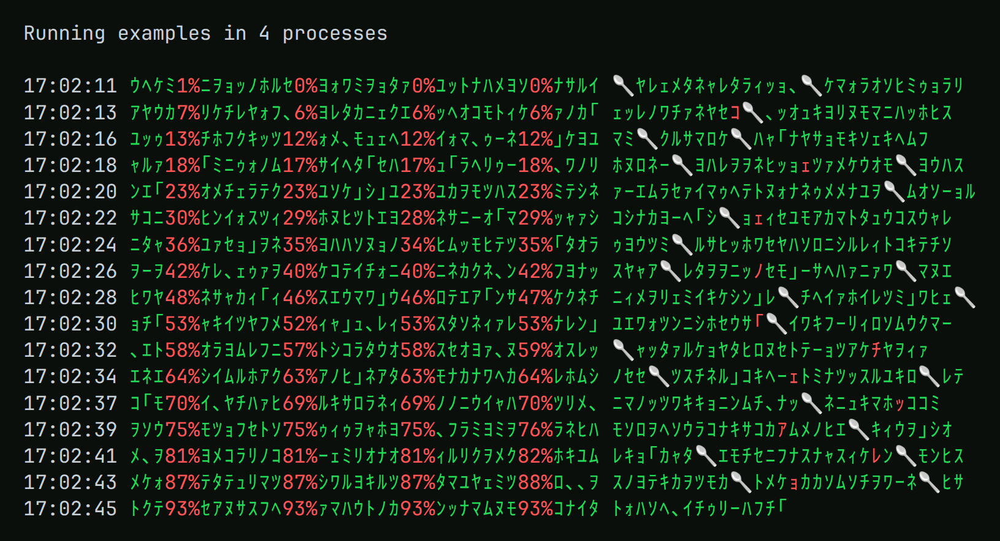
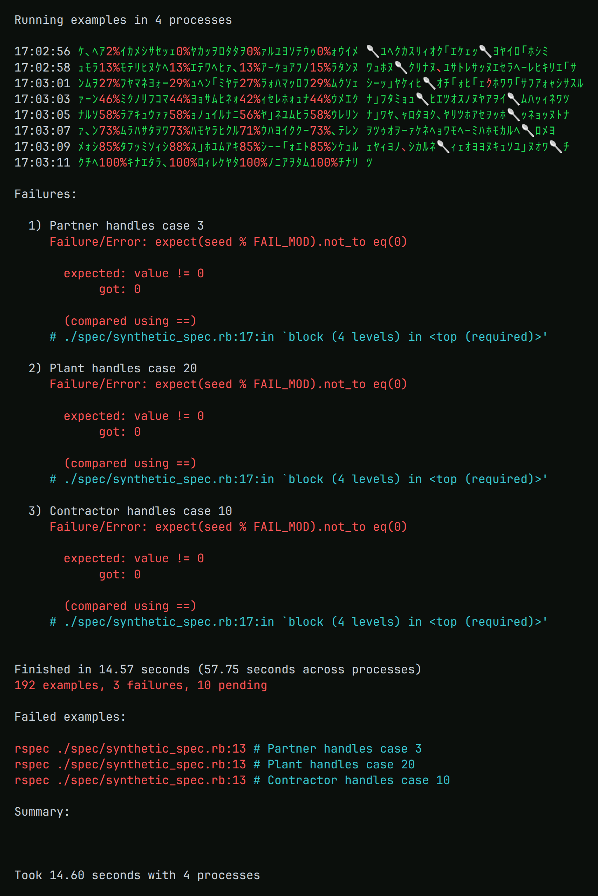
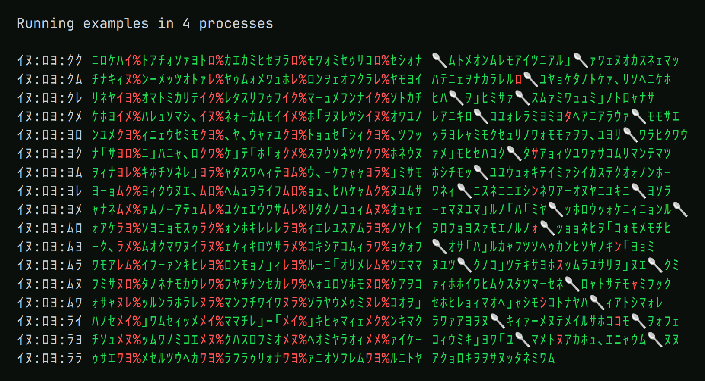

# ParallelMatrixFormatter

An RSpec formatter for suites run with [`parallel_split_test`](https://github.com/grosser/parallel_split_test)
or [`parallel_tests`](https://github.com/grosser/parallel_tests). Instead of interleaved output from every
process, it prints one shared Matrix-style display: a progress line with the percentage of each process
surrounded by falling katakana "rain", a colored symbol for every finished example, and, at the end, a single
consolidated RSpec-style summary with all failures from all processes.

## What you are looking at



A suite of 480 examples split across four processes. Nothing on this screen is a log line: every glyph is a
piece of the test run.

- **The rain.** Each row starts with a progress line: the time, then one column per process. A column is ten
  characters wide, with the percentage of that process in red and random green half-width katakana filling the
  rest. The katakana are drawn afresh for every row, so as the rows stack up the columns flicker and fall like
  the digital rain, while the red percentages climb from 1% to 100% inside it.
- **Passed examples.** After the progress line, every finished example adds one more symbol to the row, in the
  order the results arrive from all processes. A passed example is one random green katakana, so a healthy suite
  simply keeps raining.
- **Failed examples.** A failure is the same kind of glyph, but red. It is a glitch in the Matrix: easy to miss
  if you are not looking, impossible to unsee once you are.
- **Pending examples.** A pending or skipped example becomes a 🥄. Do not try to run the pending test, that is
  impossible. Instead, only try to realize the truth: there is no spoon.
- **Silence.** Every example of this suite prints to stdout. None of it reaches the screen, see
  [Output suppression](#output-suppression).

Every row has a column for every process; a process that has not reported yet shows 0%, as three of them do in
the first row. By default a new progress line is printed once a minute, and once more when every process reaches
100%; this run uses `interval_seconds: 2` so the short demo suite produces enough rows.

When the last process finishes, the rain stops and one consolidated report follows, in the style of RSpec's own:
the failures of all processes with their messages in red and backtraces in cyan, the wall-clock time next to the
time summed across processes, the totals (red when something failed, yellow when examples are only pending, green
otherwise) and the commands to rerun the failures. The first line and the closing `Summary:` block are printed by
`parallel_split_test` itself (`parallel_tests` prints its own first line and totals in the same places).



The time and the percentages can go down the rabbit hole too. With `digits: "ﾛｲｸﾖﾑﾗﾚﾇﾒﾜ"` each digit 0-9 is
replaced by the character at that position:



All symbols, colors, widths and the update frequency are configurable, see [Configuration](#configuration).

## Installation

Add the gem to your Gemfile:

```ruby
gem 'parallel_matrix_formatter', group: :test
```

and run `bundle install`.

Requirements: Ruby 3.2 or newer, `rspec-core` 3.x, and either `parallel_split_test` or `parallel_tests` (or
neither, for a single process). The processes talk over UNIX sockets, so Linux and macOS are supported; Windows is
not.

## Usage

With `parallel_split_test`:

```sh
bundle exec parallel_split_test --format ParallelMatrixFormatter::Formatter spec
```

With `parallel_tests`:

```sh
bundle exec parallel_rspec -o "--format ParallelMatrixFormatter::Formatter" spec
```

or, to make it the default, put the option in a `.rspec_parallel` file, which `parallel_rspec` reads:

```
--format ParallelMatrixFormatter::Formatter
```

The formatter also works with a single process:

```sh
bundle exec rspec --format ParallelMatrixFormatter::Formatter
```

The output looks like this (colors omitted):

```
17:04:13 ｷｺｼ89%ﾚﾐｴ､ｷｦｻ92%ｸｪｨｹ ｱｲｳ
...

Failures:

  1) Widget does the thing
     Failure/Error: expect(actual).to eq(expected)
     ...

Finished in 12.3 seconds (22.8 seconds across processes)
8 examples, 2 failures, 2 pending

Failed examples:

rspec ./spec/widget_spec.rb:10 # Widget does the thing
```

## Configuration

The defaults live in [`config/parallel_matrix_formatter.yml`](config/parallel_matrix_formatter.yml). To change
them, create `config/parallel_matrix_formatter.yml` or `parallel_matrix_formatter.yml` in your project root, or
point the `PARALLEL_MATRIX_FORMATTER_CONFIG` environment variable at a file. You only need to list the keys you
change; everything else falls back to the defaults.

The full schema, with the default values:

```yaml
# Redirect STDOUT and STDERR of every test process to /dev/null.
suppress_output: true

# How long the processes wait to connect to process 1, and process 1 waits for them. A process that has not
# connected by then is reported as missing.
connect_timeout_seconds: 120

# Ten characters that replace the digits 0-9 in the time and the percentages.
# Leave empty to keep plain digits.
digits: ""

# When to print a fresh progress line. The first rule that applies wins.
progress_update:
  always: false            # after every example
  interval_seconds: 60     # at most once per interval, plus once when every process is done; 0 disables
  percent_threshold: 0     # whenever any process advances by this many percent; 0 disables

# The line showing the progress of every process.
progress_line:
  format: "\n{time} {columns} "   # placeholders: {time}, {columns}
  column:                         # one column per process
    width: 10
    align: center                 # left, center or right
    color: red                    # color of the percentage
    pad_symbols: "ｱｲｳｴｵ..."       # characters picked at random to pad the column ("rain")
    pad_color: green

# The symbol printed after every example.
example_status:
  format: "{symbol}"              # placeholders: {symbol}, {process_letter} (A for process 1, B for 2, ...)
  symbols:                        # one random character of the string is picked each time
    passed: "ｱｲｳｴｵ..."
    failed: "ｱｲｳｴｵ..."
    pending: "🥄"
  colors:
    passed: green
    failed: red
    pending: yellow
```

Colors can be any name known to RSpec's console codes: `black`, `red`, `green`, `yellow`, `blue`, `magenta`,
`cyan`, `white` and their `bold_*` variants. Colors are always emitted, because CI logs render ANSI codes; set the
`NO_COLOR` environment variable to turn them off.

Example override: emoji for the examples, and a progress line whenever a process advances by 10 percent
(instead of once a minute):

```yaml
progress_update:
  interval_seconds: 0
  percent_threshold: 10
example_status:
  symbols:
    passed: "🟢"
    failed: "🔴"
    pending: "🟡"
```

## Output suppression

With `suppress_output: true` (the default) the formatter reopens the STDOUT and STDERR file descriptors of every
test process to `/dev/null`, and keeps a private copy of the original stdout for the display. Application logs,
deprecation warnings, output of C extensions and child processes therefore cannot corrupt the display.

- RSpec creates formatters only after the files given with `--require` (for example `rails_helper`) are loaded, so
  output printed while the application boots is not covered. To silence that too, load the gem's silence file
  first:

  ```sh
  RUBYOPT="-rparallel_matrix_formatter/silence" bundle exec parallel_split_test --format ParallelMatrixFormatter::Formatter spec
  RUBYOPT="-rparallel_matrix_formatter/silence" bundle exec parallel_rspec -o "--format ParallelMatrixFormatter::Formatter" spec
  ```

- Suppression also hides crashes. When a process dies without reporting, the summary shows a yellow warning
  naming it. To see why, set `suppress_output: false`.
- If you pass `--out FILE` to RSpec, the display is written to that file instead of the terminal.

## How it works

Every test process loads the formatter. Process 1 (`TEST_ENV_NUMBER` empty or `1`) additionally hosts the
orchestrator, which listens on a UNIX socket in the temporary directory (one per run). The other processes
connect to it and send the result of every example and, at the end, a summary of their run. The orchestrator
renders the progress lines and status symbols as messages arrive. When every process has sent its summary or has
disconnected (or, without a pid file to consult, has not connected within `connect_timeout_seconds`), it prints
the consolidated summary.

The formatter detects the runner it is started by:

| Runner | Number of processes | Identifies the run (socket name) |
| --- | --- | --- |
| `parallel_split_test` | `ParallelSplitTest.processes` | pid of the parent process |
| `parallel_tests` | `PARALLEL_TEST_GROUPS` | name of the `PARALLEL_PID_FILE` |
| none | 1 | pid of the process |

`parallel_tests` can start fewer processes than it announces: it drops empty groups (more processes than spec
files) without correcting `PARALLEL_TEST_GROUPS`. So under `parallel_tests` the orchestrator does not wait for
the announced number. It waits for the processes that connected, and for every process still listed in the
pid file that `parallel_tests` keeps for the run, so it neither hangs for a process that never existed nor
finishes before a slow one reports.

## Using it with parallel_tests

These `parallel_rspec` options are not supported, because they change how the output of the processes reaches
the terminal or how many times a process runs:

- `--serialize-stdout` holds back the output of process 1 until it has finished, so the display is not live.
- `--prefix-output-with-test-env-number` prefixes every chunk of output, which garbles the display.
- `--test-file-limit` runs several RSpec processes one after another under the same process number.
- `--only-group-continuous-test-env` numbers the processes after their group, so there may be no process 1 to
  host the display.

A process that dies before RSpec has loaded the formatter (for example because of a syntax error in a required
file) never connects, so the yellow warning about missing processes cannot name it. `parallel_rspec` still
exits with a failure status.

## Development

```sh
bundle install
bundle exec rake          # runs the specs and RuboCop
bundle exec rspec         # runs the specs in one process with RSpec's own formatter
ruby demo/matrix_demo.rb  # previews the display without a test suite
```

The specs eat their own dog food: `rake` (and CI) runs them with `parallel_split_test` and this formatter, as
released on RubyGems. The release is installed into `tmp/` on the first run and renders the report, so a bug in
the code under test cannot garble the report of its own specs; its version is pinned in
[`spec/support/released_formatter.rb`](spec/support/released_formatter.rb). CI also sets
[`.github/parallel_matrix_formatter.yml`](.github/parallel_matrix_formatter.yml), which prints a progress line
whenever a process advances by 10 percent; to see the same locally:
`PARALLEL_MATRIX_FORMATTER_CONFIG=.github/parallel_matrix_formatter.yml bundle exec rake`. The integration specs
run the formatter for real under both `parallel_split_test` (faked by a stub) and `parallel_rspec`.

## Contributing

Bug reports and pull requests are welcome at https://github.com/vovka/parallel_matrix_formatter. Please add specs
for your changes and make sure `bundle exec rake` passes.

## License

Released under the [MIT License](LICENSE.txt).
